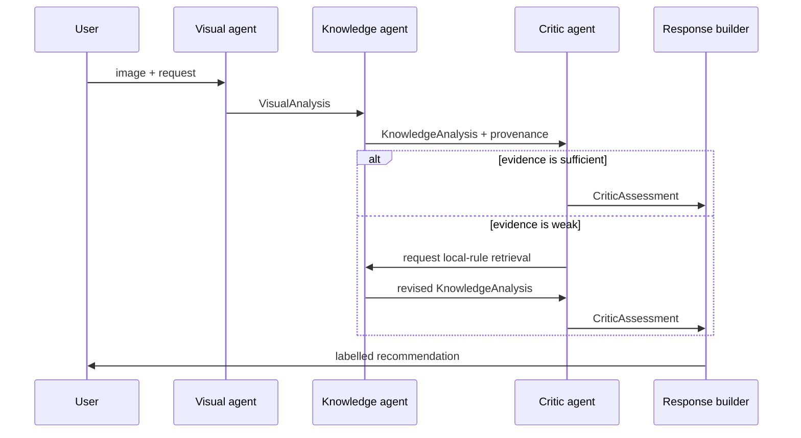

# Architecture

The application uses a small stateful workflow. Each agent consumes a typed
record and returns another typed record; no agent mutates hidden global state.



## The decisions

| Agent | Decision | Current policy | Easy extension |
| --- | --- | --- | --- |
| Visual | Is captioning needed? | Low colour confidence or image quality | Add object detection |
| Knowledge | Use a local rule? | Complex request or uncertain image | Add semantic retrieval |
| Critic | Revise? | Weak grounding or too few matches | Add a rubric or evaluator |

The LangChain pipeline only connects the initial three stages. The revision loop
is explicit Python because it is the part learners need to reason about first.

```text
Runnable sequence: Visual → Knowledge → Critic
Explicit control flow: Critic decision → optional Knowledge retry
```

This separation is intentional: framework syntax should make the workflow easier
to inspect, not obscure the policy being taught.
