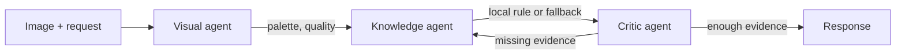

# Fashion Agentic Assistant

A small, runnable class on agentic AI. It analyses the dominant colours in an
outfit image, retrieves a local fashion rule, lets a critic inspect the evidence,
and produces a recommendation with its provenance visible.

It is designed for newcomers: the workflow is useful, but it does not pretend to
be autonomous or to use an LLM where a deterministic rule is clearer.



## What you will learn

| Concept | Where to see it |
| --- | --- |
| State passed between agents | `src/schemas.py` |
| Routing decision | `VisualAgent` and `KnowledgeAgent` |
| Tool use | Optional Florence-2 captioning |
| Grounding | `data/fashion_rules.json` |
| Critic/revision loop | `src/agents/orchestrator.py` |
| Framework composition | LangChain `RunnableLambda` pipeline |

## Quick start

Requires Python 3.12 and [uv](https://docs.astral.sh/uv/).

```bash
uv sync --all-groups
uv run fashion-assistant --show-trace
```

Try another image or request:

```bash
uv run fashion-assistant \
  --image data/sample_images/test2.jpg \
  --request "Suggest colours for a relaxed weekend outfit" \
  --show-trace
```

The default route is deterministic and does not call an API or download a model.
Captioning is a deliberately optional branch. On a low-quality image it loads
Florence-2 from Hugging Face the first time it is needed; this needs network
access, model-cache space, and the dependencies already locked in `uv.lock`.

## Read the workflow

```text
Workflow state
├── VisualAnalysis      palette, image quality, caption decision
├── KnowledgeAnalysis   colour rule, matches, evidence label
└── CriticAssessment    completeness, grounding, revision decision
```

LangChain is used for composition, not as a black box:

```python
RunnableLambda(self._run_visual) | RunnableLambda(self._run_knowledge) | RunnableLambda(self._run_critic)
```

Each runnable calls ordinary, typed Python. Start with
[`src/agents/orchestrator.py`](src/agents/orchestrator.py), then follow the trace
printed by `--show-trace`.

## Project layout

```text
src/
├── agents/        # visual, knowledge, critic, and orchestration
├── generation/    # evidence-labelled response
├── knowledge/     # local rule loading and matching
├── utils/         # image, colour, and optional caption utilities
├── schemas.py     # records shared by agents
└── main.py        # CLI
data/
└── fashion_rules.json
docs/
└── lesson-01-workflow.md
```

## Reproducibility and checks

`uv.lock` pins the resolved environment. Run the complete local check before
changing behaviour:

```bash
uv run ruff check .
uv run pytest
```

The colour-clustering random seed is fixed. Results can still vary slightly
between supported numeric-library platforms, so tests assert behaviour and
invariants rather than exact cluster-centre values.

## Boundaries and honest limitations

- The fashion rules are bundled project data, not live or expert-verified advice.
- “Grounding” means a recommendation names its local rule source; it is not a
  guarantee that the advice is correct for every context.
- The critic checks structured evidence. It does not evaluate factual truth or
  write a new answer.
- This starter workflow has no remote LLM, API key, vector database, or hidden
  agent memory.

## Continue learning

Work through [Lesson 1: inspect and extend a workflow](docs/lesson-01-workflow.md).
Good next experiments are adding a rule, changing a routing threshold, writing a
test for it, and only then swapping a deterministic component for an LLM.
